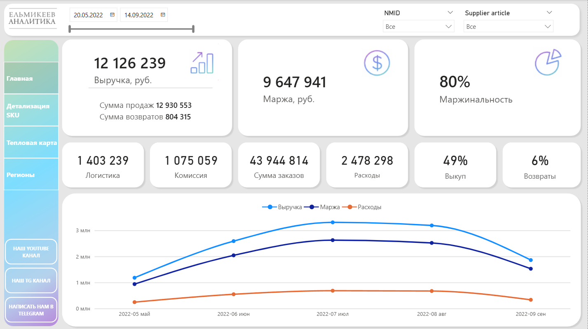
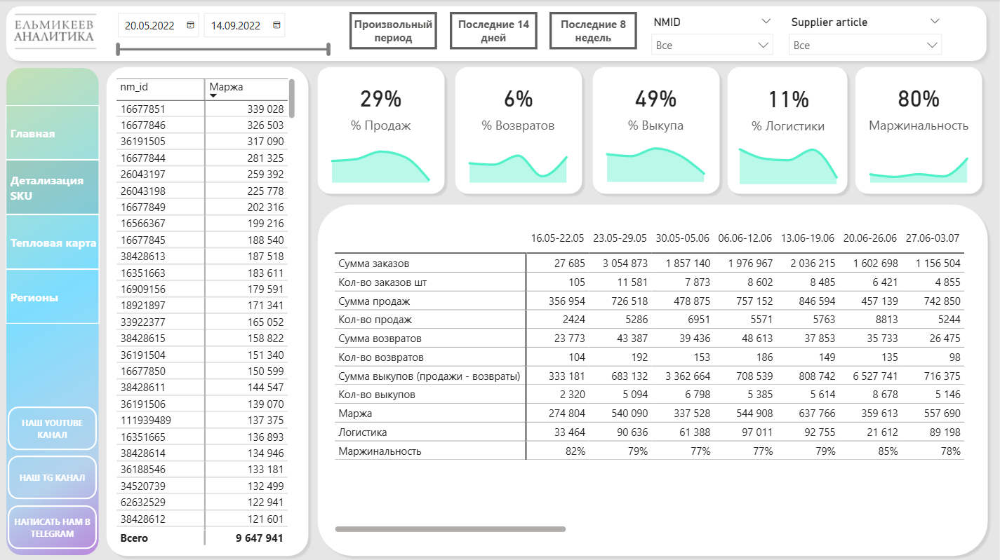
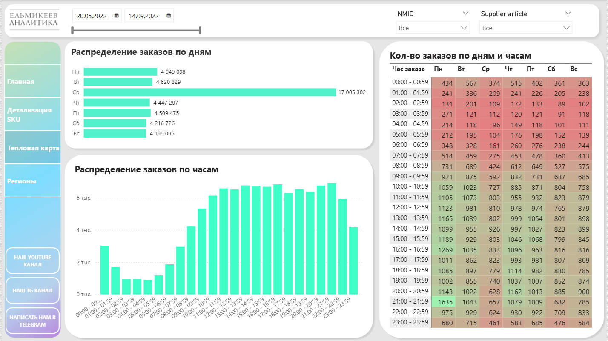
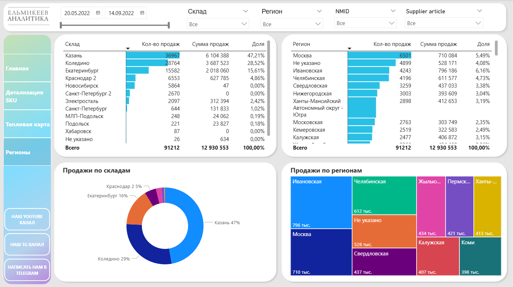

# Комплексный анализ продаж селлера Wildberries

## Описание проекта
Интерактивный дашборд в Power BI для комплексного мониторинга коммерческих показателей селлера на маркетплейсе Wildberries. Отчет объединяет финансовые KPI, детализацию по артикулам (SKU), анализ временных пиков спроса и географическое распределение продаж по складам и регионам.

## Ссылка на проект
https://drive.google.com/file/d/1dpoyGkwgF0oi8S4B3v-Nlzo7D4cuZ4Yg/view?usp=sharing

### Ключевые задачи:
*    **Сквозной мониторинг KPI:** отслеживание выручки, маржи, маржинальности, процента выкупа и уровня возвратов.
*    **Детализация SKU:** глубокий анализ экономики отдельного артикула с возможностью переключения временных периодов (14 дней, 8 недель, произвольный выбор).
*    **Анализ поведения покупателей:** построение тепловой карты заказов по дням недели и часам для оптимизации графиков рекламы и продвижения.
*    **Гео-аналитика и логистика:** оценка эффективности распределения товаров по складам (Казань, Коледино, Екатеринбург) и регионам доставки.

---

## Технический стек
*    **Power Query (M):** Чистка данных, подгонка под единый стандарт, создание справочников (Склады, Регионы, SKU, Календарь) и объединение разрозненных таблиц заказов за разные временные интервалы в единый массив.
*    **DAX:** Расчет ключевых метрик (выручка, сумма выкупов, маржинальность, % логистики, % возвратов), создание быстрых мер для динамической фильтрации (последние 14 дней / 8 недель) и расчета показателей в разрезе SKU.
*    **Data Visualization:** Навигационное меню по 4 ключевым вкладкам (*Главная*, *Детализация SKU*, *Тепловая карта*, *Регионы*), использование sparklines в таблицах, тепловых матриц с условным форматированием и древовидных диаграмм (Treemap).

---

## Основные инсайты (на основе данных)
1.   **Финансовая эффективности:** Бизнес демонстрирует высокую маржинальность (**80%**) при общей выручке **12,12 млн руб.** и марже **9,65 млн руб.** Основной статьей затрат остается логистика (**1,40 млн руб.**, 11% от объема продаж).
2.   **Концентрация логистики:** Ключевым логистическим хабом является **Казань**, обеспечивающая **47,21%** от всей суммы продаж (6,10 млн руб.), на втором месте — **Коледино** (**28,52%**). 
3.   **Пики покупательской активности:** По результатам тепловой карты выявлен аномальный всплеск заказов в **среду** (17 млн руб. против ~4.2–4.9 млн в другие дни). Пиковое время заказов внутри дня приходится на интервал с **10:00 до 21:00**, с абсолютным максимумом в **21:00–21:59** (особенно в понедельник — 1 635 заказов).
4.   **Воронка продаж:** Общая сумма заказов составила **43,94 млн руб.**, из которых фактический выкуп равен **49%**. При относительно низком уровне возвратов (**6%**) ключевой точкой роста является повышение конверсии из заказа в выкуп на этапе логистики и выдачи в ПВЗ.

---
[← Назад к списку проектов](../README.md)
