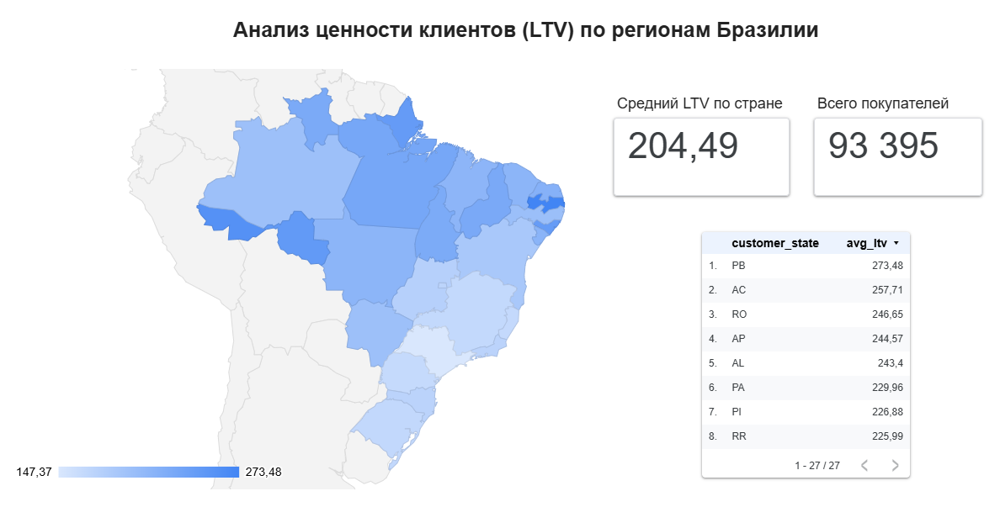

# Business Intelligence: Интерактивный дашборд LTV

В данном разделе представлена финальная визуализация данных маркетплейса Olist, выполненная в **Looker Studio**. Цель - предоставить бизнесу удобный инструмент для мониторинга региональных показателей без необходимости чтения кода.

## 1. Описание бизнес-задачи
Руководству компании требуется наглядный инструмент для оценки "качества" клиентской базы в разных штатах. Необходимо быстро определять регионы с максимальной пожизненной ценностью клиента (LTV) для корректировки маркетинговых бюджетов и логистических приоритетов.

## 2. Как я решал задачу
1.  **Подготовка данных**: Данные были агрегированы в SQL и экспортированы в формат CSV.
2.  **ETL-процесс**: Данные импортированы в Google Sheets и подключены к Looker Studio с правильным сопоставлением типов (Geo-данные для штатов и Numeric для финансовых показателей).
3.  **Визуализация**:
    *   **Географическая карта**: для выявления пространственных паттернов.
    *   **Scorecards (Сводные карточки)**: для быстрого считывания KPI (общий объем базы и средний LTV).
    *   **Детализированная таблица**: для получения точных цифр по каждому штату.

## 3. Ссылка на интерактивный отчет
**[ОТКРЫТЬ В LOOKER STUDIO](https://datastudio.google.com/reporting/a586127d-906a-4d3e-b44c-cd5f0f721be9)**
*(Для корректного отображения рекомендуется использовать десктопную версию браузера, 
следует упомянуть что сервис LOOKER STUDIO недоступен к использованию в России)*

## 4. Ключевые инсайты
*   **Региональные различия**: Карта наглядно подтверждает, что северные штаты (RR, AP, AC) имеют более высокий средний LTV. Это может указывать на специфический спрос на дорогостоящие категории товаров в этих регионах.
*   **Концентрация базы**: Несмотря на более низкий средний чек, штат Сан-Паулу (SP) генерирует основной поток транзакций (40% всей базы), что делает его ключевым для операционной стабильности.

---
**Инструменты**: Looker Studio (Google Data Studio), Google Sheets.
**Навыки**: BI Reporting, Data Transformation, Dashboard Design.
