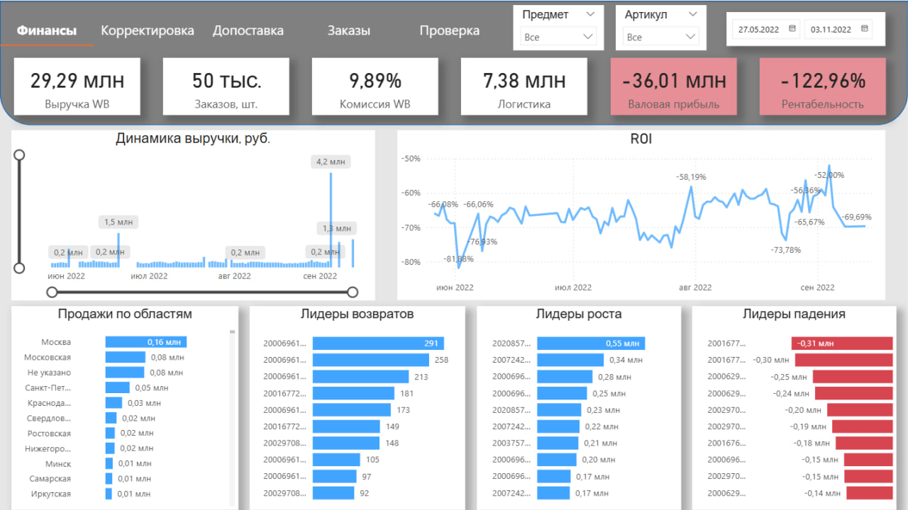

# Финансовый дашборд для поставщика Wildberries

## Описание проекта
Интерактивный дашборд в Power BI для глубокого анализа финансовых показателей магазина на маркетплейсе. Основная цель отчета - диагностика причин отрицательной прибыли и поиск «точек роста» бизнеса.

### Ключевые задачи:
*   **Мониторинг KPI:** выручка, количество заказов, затраты на логистику и комиссии.
*   **Анализ убытков:** поиск «лидеров падения» по прибыли среди артикулов.
*   **Эффективность инвестиций:** контроль динамики ROI и общей рентабельности.
*   **Логистика и возвраты:** анализ географии продаж и структуры причин возврата товаров.

---

## Технический стек
*   **Power Query (M):** Очистка данных, объединение таблиц по API/Excel, трансформация типов данных.
*   **DAX:** Расчет сложных мер (ROI, % рентабельности, скользящее среднее выручки, логика ABC-анализа для возвратов).
*   **Data Visualization:** Проектирование UI/UX, использование кнопок навигации, закладок (bookmarks) и условного форматирования.

---

## Основные инсайты (на основе данных)
1.  **Диагностика убытков:** Обнаружена отрицательная валовая прибыль (-36 млн), вызванная аномально высокой долей логистических затрат и возвратов по конкретным артикулам.
2.  **Эффективность логистики:** Выявлены регионы с самой дорогой логистикой относительно объема продаж, что требует пересмотра стратегии распределения по складам.
3.  **Оптимизация ассортимента:** Сформирован список «Лидеров падения», которые рекомендуется вывести из ассортимента для остановки операционных убытков.

---
[← Назад к списку проектов](../README.md)
