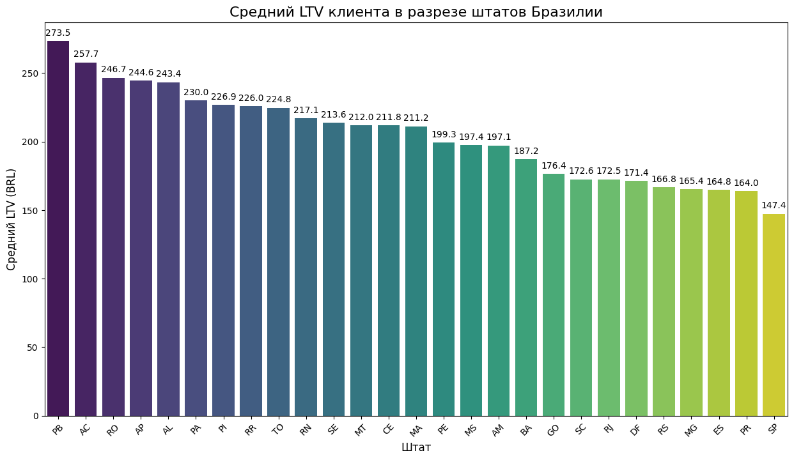

# Визуализация и исследовательский анализ данных (EDA) на Python

В этом разделе представлен этап визуализации данных, полученных в ходе SQL-анализа маркетплейса Olist. Использование Python позволяет автоматизировать построение графиков и проводить более глубокий статистический анализ.

## Проект: Визуализация распределения LTV по штатам

### 1. Описание задачи
После расчета показателя LTV (Lifetime Value) в SQL, необходимо было наглядно представить различия в ценности клиентов между 27 штатами Бразилии. Визуализация помогает быстро выявить регионы-лидеры и аномалии, которые сложно заметить в табличном виде.

### 2. Используемый стек
*   **Pandas**: загрузка данных из CSV, первичный осмотр и проверка типов.
*   **Seaborn & Matplotlib**: построение кастомизированной столбчатой диаграммы с цветовой схемой `viridis`.
*   **Jupyter Notebook**: интерактивная среда для разработки и документирования хода анализа.

### 3. Ключевые результаты
На графике ниже представлено распределение среднего LTV по штатам:

**Главный инсайт:** 
Самые высокие показатели LTV наблюдаются не в самом густонаселенном штате (Сан-Паулу - SP), а в удаленных регионах, таких как **PB (Параиба)** и **AC (Акри)**. 
*   **Бизнес-вывод:** Клиенты из удаленных штатов делают более дорогие покупки. Это может быть связано с тем, что из-за дорогой или долгой доставки пользователи предпочитают заказывать сразу "на большую сумму" или покупать более дорогостоящие товары, которые сложно найти локально.

---
## Состав папки
*   [LTV_analysis.ipynb](./LTV_analysis.ipynb) - ноутбук с кодом и комментариями.
*   [state_ltv.csv](./state_ltv.csv) - датасет, полученный в результате SQL-запроса.
*   [ltv_by_state.png](./ltv_by_state.png) - финальная визуализация.

---
**Навыки:** Python (EDA), Data Visualization, Business Insights, Pandas, Seaborn.
