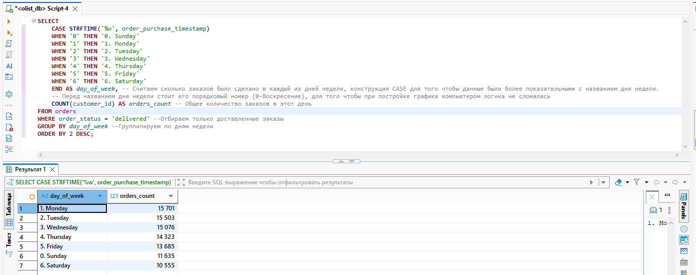
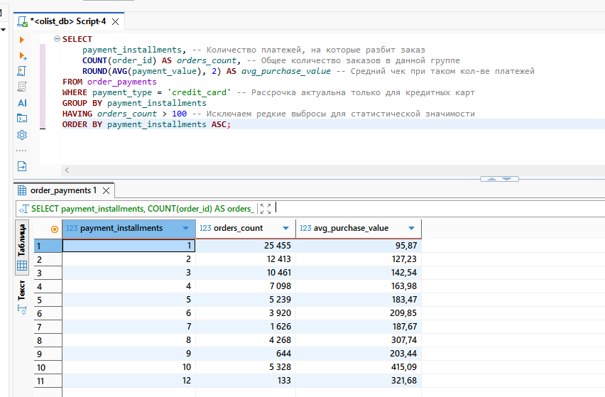
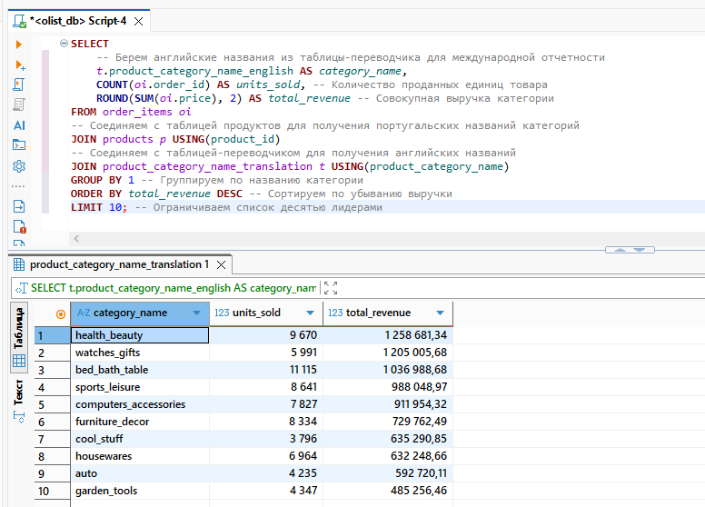

# Визуализация результатов: Потребительское поведение

### 1. Активность по дням недели
*Скриншот показывает распределение заказов: от самого популярного дня к наименее активному.*

---

### 2. Зависимость чека от количества рассрочек
*Наглядно видно, как растет средний чек заказа при увеличении количества доступных платежей.*

---

### 3. Топ-10 категорий по выручке
*Рейтинг категорий, приносящих маркетплейсу основную прибыль.*

