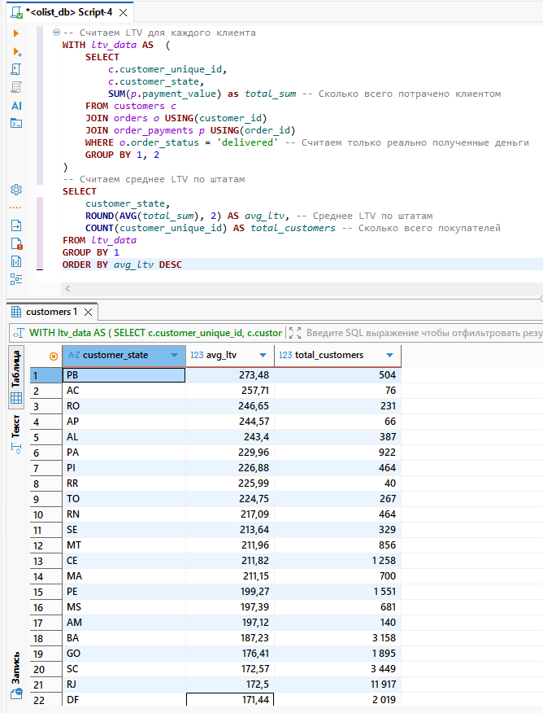
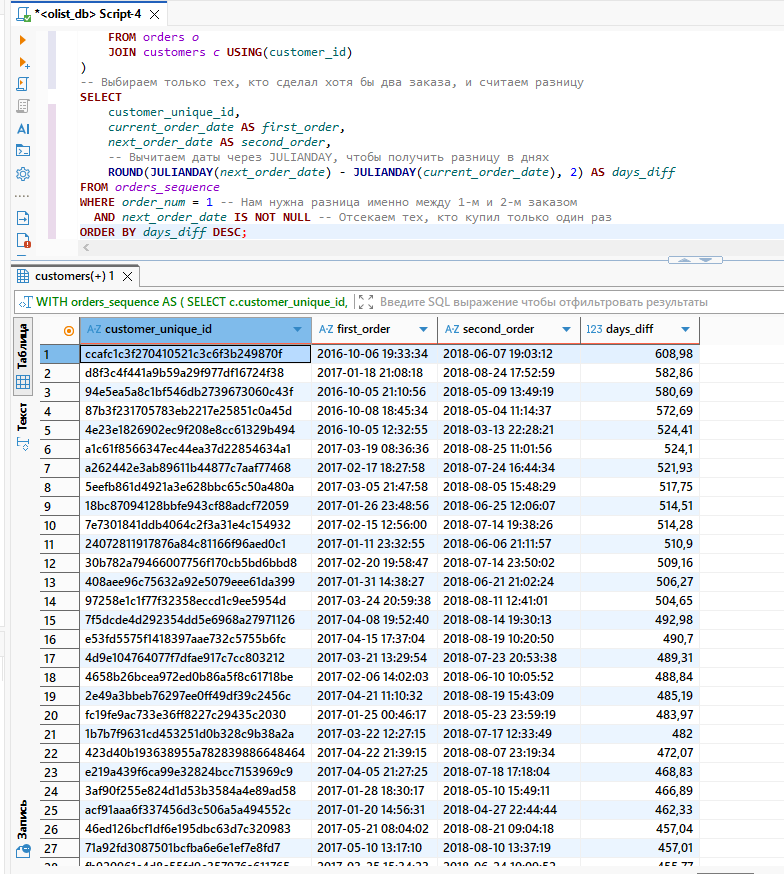

# Визуализация результатов: Экономика клиента (SQL Screenshots)

В данном разделе представлены подтверждения результатов выполнения SQL-запросов для анализа ценности клиентов (LTV) и их удержания (Retention).

---

### 1. Расчет среднего LTV в разрезе штатов Бразилии
*На скриншоте видна агрегация по уникальным пользователям и расчет среднего чека за весь период жизни клиента.*

---

### 2. Анализ интервалов между повторными покупками (LEAD Function)
*Демонстрация работы оконных функций для вычисления разницы в днях между первым и вторым заказом клиента.*

